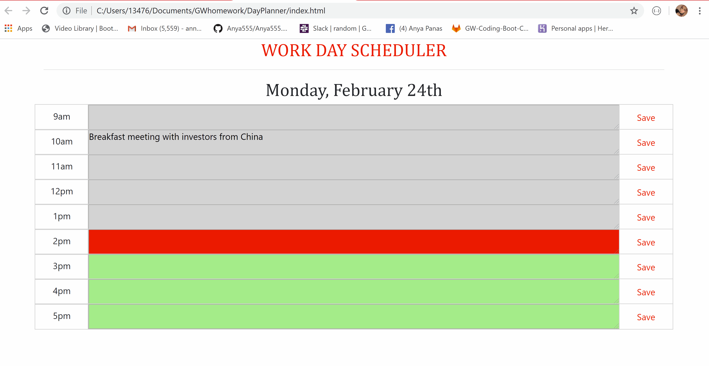

# DayPlanner

Day planner is a simple calendar application that allows the a busy employer save events for each hour of the day from 9 am to 5pm. 

* Technologies used to build this app:

- Bootstrap for CSS grid
- Jquery for app functionality
- Localstorage for storing user notes
- Moment.js library to work with day and time

APP FLOW:

 Current date is displayed on top of the page. Each hour is color coded to reflect whether the time slot is in the past (grey), the present (red), or the future (green). User can write notes into input fields and click "save" button so notes get stored after the page is reloaded.

 